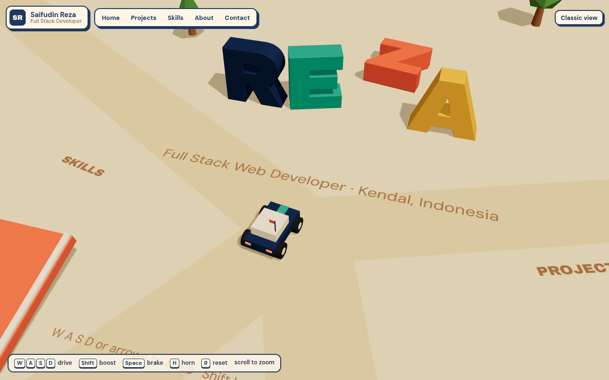
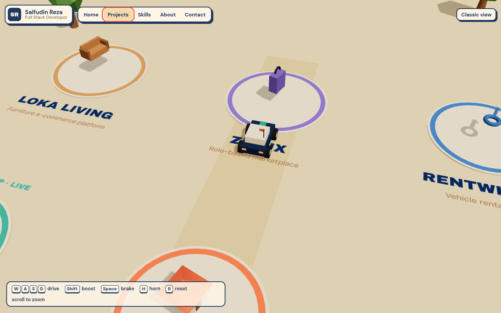
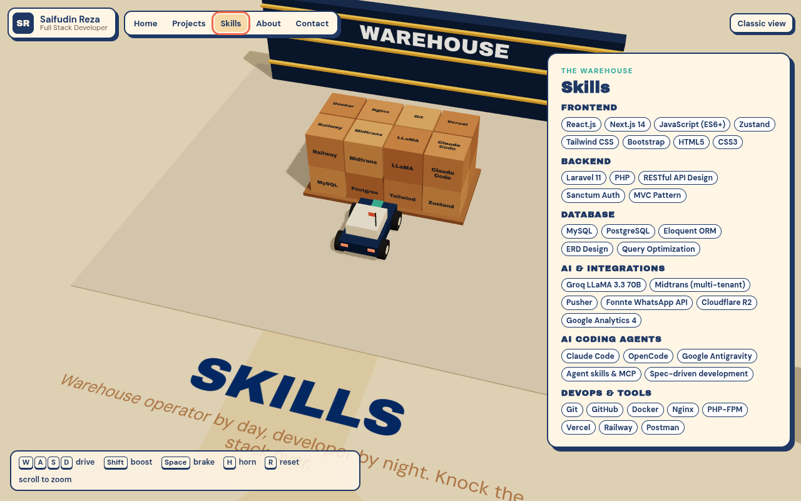

# Zare World · 3D portfolio of Saifudin Reza

An interactive portfolio where you drive a small car around an island to explore my projects, skills and contact details. Inspired by the playful "drive around the portfolio" idea popularised by Bruno Simon, built from scratch with my own world, models and content.



| Projects | Skills | Mobile |
| --- | --- | --- |
|  |  |  |

## What's in the world

- **Home**: big extruded `REZA` letters. Each letter is a physics body, so you can knock them over.
- **Projects**: one pad per project (KasirAI, KostKu, TrustPay, Loka Living, ZFlux, RentWheels). Park on a pad and a card opens with highlights, stack and live links. Press `Enter` to open the live app.
- **Skills (the warehouse)**: a stack of knockable crates labelled with my stack, a nod to my day job as a warehouse operator.
- **About**: education, certifications and work experience.
- **Contact**: GitHub, LinkedIn and email pads.
- A jump ramp and a cone slalom, just for fun.
- **Classic view**: the whole portfolio as a normal scrollable page, for recruiters in a hurry and for devices without WebGL.

Controls: `W A S D` or arrow keys to drive, `Shift` boost, `Space` brake, `H` horn, `R` reset, scroll to zoom. Phones and tablets get on-screen pedals. The top bar lets you jump straight to any area.

## Tech stack and why

| Layer | Choice | Why |
| --- | --- | --- |
| Build | **Vite + React 19 + TypeScript** | Fast dev server, static output that deploys anywhere. React because the UI (cards, loader, classic view) is ordinary React, the same thing I use daily. |
| 3D | **three.js via React Three Fiber** | three.js is the same engine behind Bruno Simon's site. R3F lets the 3D world be written as React components and share state with the HTML UI. |
| Helpers | **@react-three/drei** | Crisp SDF text on the ground and signs, loading progress. |
| Physics | **Rapier (@react-three/rapier)** | Rust physics compiled to WASM. Fast, stable, and also what Bruno Simon's 2025 portfolio uses. |
| State | **Zustand** | Tiny store for "which pad is the car on", teleports and UI state. Driving input is a plain mutable object so it never triggers re-renders. |
| Hosting | **Vercel** | Static Vite build, zero config. |

No Next.js here on purpose: the site is a single interactive canvas with no server-side data, so SSR adds weight without benefit.

## Run locally

```bash
npm install
npm run dev       # http://localhost:5173
npm run build     # type-check + production build into dist/
npm run preview   # serve the production build
```

Add `?debug` to the URL to see physics colliders.

## Deploy to Vercel

1. Push this folder to a new GitHub repo.
2. In Vercel, **Add New → Project**, import the repo.
3. Vercel detects Vite automatically (build `npm run build`, output `dist`). Click **Deploy**.

## Editing content

All text lives in [`src/data/profile.ts`](src/data/profile.ts): summary, projects, skills, education, certifications and experience. Add a project there and it appears in both the 3D world and the classic view. Pad positions are in [`src/world/layout.ts`](src/world/layout.ts) (the grid holds 6 projects; add a position for a 7th).

## Project structure

```
src/
  data/profile.ts        all portfolio content
  store.ts               Zustand store + driving input
  world/
    Experience.tsx       scene root: lights, physics world, all areas
    Car.tsx              arcade car physics, visuals and follow camera
    Letters.tsx          knockable 3D letters
    Zones.tsx            projects, warehouse, about and contact areas
    Environment.tsx      ground, roads, trees, ramp, cones, sun
    Props.tsx            little models that float over each project pad
    common.tsx           sensors, ground text, signboards
    layout.ts            positions, roads and colour palette
  ui/                    loader, top bar, cards, touch pedals, classic view
public/fonts/            Archivo Black + DM Sans (OFL), plus a typeface JSON for the 3D letters
```

## Credits

Fonts: Archivo Black and DM Sans, SIL Open Font License. Concept inspired by [bruno-simon.com](https://bruno-simon.com). All models are simple primitives made for this project.
