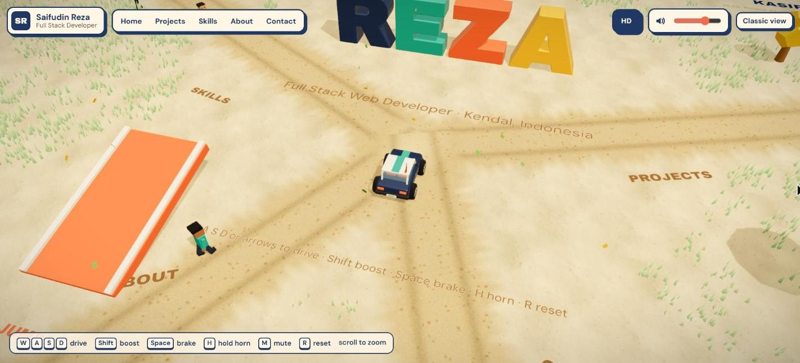
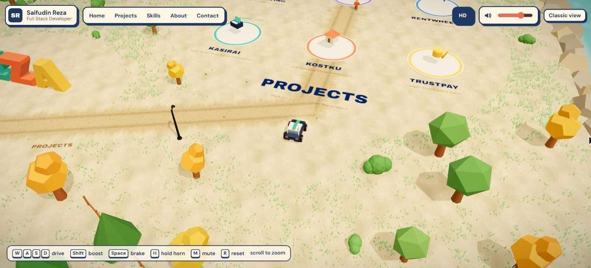
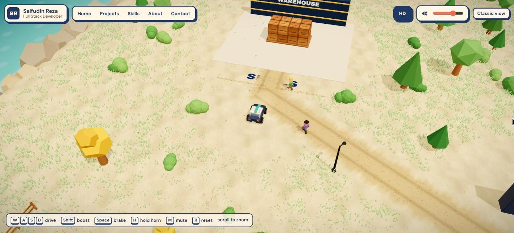
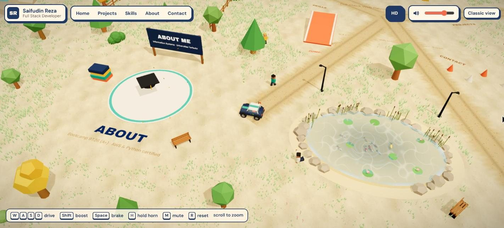
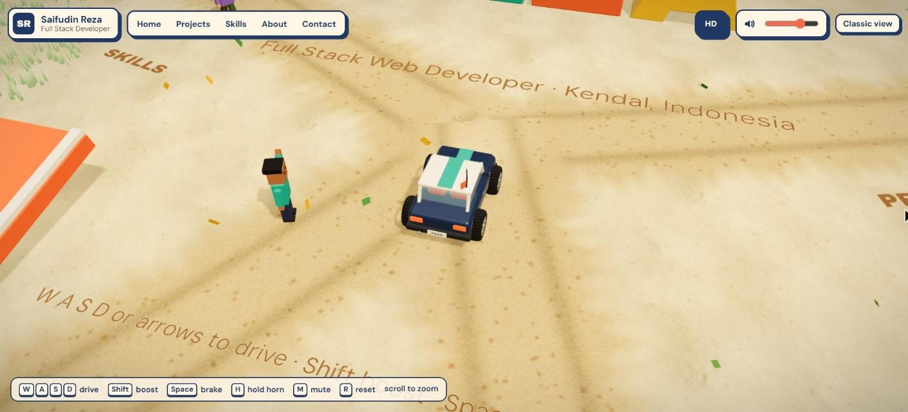
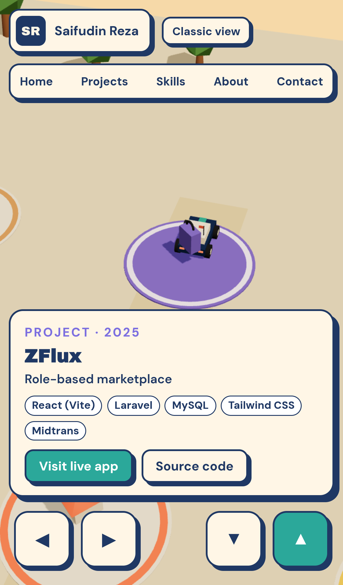

# Zare World · 3D portfolio of Saifudin Reza

An interactive portfolio where you drive a small car around an island to explore my projects, skills and contact details. Inspired by the playful "drive around the portfolio" idea popularised by Bruno Simon, built from scratch with my own world, models and content.



| Projects | Skills | Koi pond & About |
| --- | --- | --- |
|  |  |  |

| The car | Mobile |
| --- | --- |
|  |  |

## What's in the world

- **Home**: big extruded `REZA` letters. Each letter is a physics body, so you can knock them over.
- **Projects**: one pad per project (KasirAI, KostKu, TrustPay, Loka Living, ZFlux, RentWheels). Park on a pad and a card opens with highlights, stack and live links. Press `Enter` to open the live app.
- **Skills (the warehouse)**: a stack of knockable crates labelled with my stack, a nod to my day job as a warehouse operator.
- **About**: education, certifications and work experience.
- **Contact**: GitHub, LinkedIn and email pads.
- A jump ramp and a cone slalom, just for fun.
- **Classic view**: the whole portfolio as a normal scrollable page, for recruiters in a hurry and for devices without WebGL.

Controls: `W A S D` or arrow keys to drive, `Shift` boost, `Space` brake, hold `H` for the horn, `M` mute, `R` reset, scroll to zoom. Phones and tablets get on-screen pedals and a horn button. The top bar lets you jump straight to any area, switch graphics between **HD** and **Lite**, and set the volume.

## Graphics and performance

- **HD** (default on desktop): image-based reflections from a few `Lightformer` panels (no HDRI file), plus post-processing: bloom on lights and emissives, ACES tone mapping, a light warm grade, vignette and SMAA. Ambient occlusion (N8AO) is tried for the first few seconds and switches itself off if the frame rate drops under 50 FPS, since it is the most expensive pass.
- **Lite** (default on touch devices): no post-processing and no environment map; everything else stays.
- The car is built from rounded primitives: clearcoat paint, see-through glass with seats inside, chrome grille and five-spoke rims, bulging tyres with tread, `REZA` plates, working brake lights, a headlight pool on the ground, visual suspension and a flapping antenna flag. Driving kicks up dust, braking and sliding leave skid marks, the exhaust smokes and boost lights a flame.
- The island has a sky dome with drifting clouds, a sea with foam around rocky cliffs, a sandy ground with a normal map, roads with ragged edges and wheel ruts, bushes, flowers, fences, street lamps, benches, butterflies and leaves on the wind.
- **Asset budget:** every texture is drawn on a canvas at startup, so the visual upgrade adds no image, model or audio files. The code grows the 3D chunk by about 27 kB gzipped; the post-processing library (about 162 kB gzipped) is a separate chunk that only loads on HD.
- Measured on the development laptop (integrated GPU, 1422×647 at 1.35 DPR): the previous version ran at about 80 FPS, the new Lite mode at about 63 FPS and HD at about 47 FPS (AO switched itself off there).

## Tech stack and why

| Layer | Choice | Why |
| --- | --- | --- |
| Build | **Vite + React 19 + TypeScript** | Fast dev server, static output that deploys anywhere. React because the UI (cards, loader, classic view) is ordinary React, the same thing I use daily. |
| 3D | **three.js via React Three Fiber** | three.js is the same engine behind Bruno Simon's site. R3F lets the 3D world be written as React components and share state with the HTML UI. |
| Helpers | **@react-three/drei** | Crisp SDF text on the ground and signs, loading progress. |
| Post-processing | **@react-three/postprocessing** | Bloom, SMAA, tone mapping, grading and ambient occlusion for the HD setting, lazy-loaded so Lite never downloads it. |
| Physics | **Rapier (@react-three/rapier)** | Rust physics compiled to WASM. Fast, stable, and also what Bruno Simon's 2025 portfolio uses. |
| State | **Zustand** | Tiny store for "which pad is the car on", teleports and UI state. Driving input is a plain mutable object so it never triggers re-renders. |
| Hosting | **Vercel** | Static Vite build, zero config. |

No Next.js here on purpose: the site is a single interactive canvas with no server-side data, so SSR adds weight without benefit.

## Run locally

```bash
npm install
npm run dev       # http://localhost:5173
npm run build     # type-check + production build into dist/
npm run preview   # serve the production build
```

Add `?debug` to the URL to see physics colliders.

## Deploy to Vercel

1. Push this folder to a new GitHub repo.
2. In Vercel, **Add New → Project**, import the repo.
3. Vercel detects Vite automatically (build `npm run build`, output `dist`). Click **Deploy**.

## Editing content

All text lives in [`src/data/profile.ts`](src/data/profile.ts): summary, projects, skills, education, certifications and experience. Add a project there and it appears in both the 3D world and the classic view. Pad positions are in [`src/world/layout.ts`](src/world/layout.ts) (the grid holds 6 projects; add a position for a 7th).

## Project structure

```
src/
  data/profile.ts        all portfolio content
  store.ts               Zustand store + driving input
  world/
    Experience.tsx       scene root: lights, physics world, all areas
    Car.tsx              arcade car physics, follow camera, collision sounds
    CarModel.tsx         the car's looks: body, glass, lights, wheels, suspension, flag
    CarFx.tsx            wheel dust, skid marks, exhaust smoke, boost flame
    Atmosphere.tsx       sky, clouds, sea, cliffs, environment lighting
    PostFx.tsx           post-processing for HD quality
    Details.tsx          bushes, flowers, lamps, fences, benches, butterflies, leaves
    textures.ts          procedural canvas textures (sand, roads, wood, tyre tread)
    Letters.tsx          knockable 3D letters
    Zones.tsx            projects, warehouse, about and contact areas
    Environment.tsx      ground, roads, ramp, cones, sun
    Props.tsx            little models that float over each project pad
    common.tsx           sensors, ground text, signboards
    layout.ts            positions, roads and colour palette
  ui/                    loader, top bar, cards, touch pedals, classic view
public/fonts/            Archivo Black + DM Sans (OFL), plus a typeface JSON for the 3D letters
```

## Credits

Fonts: Archivo Black and DM Sans, SIL Open Font License. Concept inspired by [bruno-simon.com](https://bruno-simon.com). All models are simple primitives made for this project. All sounds (engine, horn, collisions, splashes) are synthesised at runtime with the Web Audio API, so there are no third-party audio files to license.
