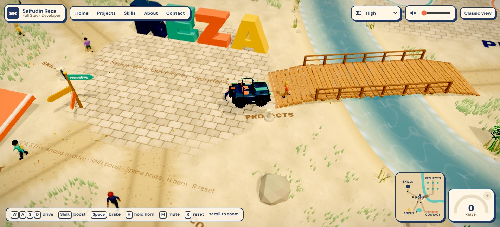
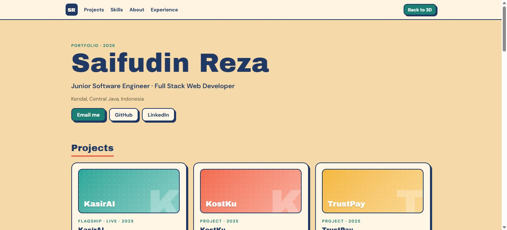

# Zare World · 3D portfolio of Saifudin Reza

An interactive portfolio where you drive a little jeep around an island to explore my projects, skills and contact details. Inspired by the playful "drive around the portfolio" idea popularised by Bruno Simon, built from scratch with my own world, models and content.


| Projects | Skills | Koi pond & About |
| --- | --- | --- |
|  |  |  |

| River & bridge | The car | Classic view | Mobile |
| --- | --- | --- | --- |
|  |  |  |  |

## What's in the world

- **Home**: big extruded `REZA` letters. Each letter is a physics body, so you can knock them over.
- **Projects**: one pad per project (KasirAI, KostKu, TrustPay, Loka Living, ZFlux, RentWheels). Park on a pad and a card opens with highlights, stack and live links. Press `Enter` to open the live app.
- **Skills (the warehouse)**: a stack of knockable crates labelled with my stack, a nod to my day job as a warehouse operator.
- **About**: education, certifications and work experience.
- **Contact**: GitHub, LinkedIn and email pads.
- **River and bridge**: a river winds from the north shore past Home and out to the east, spilling off the cliffs as a waterfall at both ends. A wooden bridge carries the Projects road over it; anywhere else you can wade across (slowly, with a splash).
- A jump ramp and a cone slalom, just for fun.
- **Classic view**: the whole portfolio as a normal scrollable page, for recruiters in a hurry and for devices without WebGL.

Controls: `W A S D` or arrow keys to drive, `Shift` boost, `Space` brake, hold `H` for the horn, `M` mute, `R` reset, scroll to zoom. On phones and tablets a thumb joystick (or arrow buttons, switchable) drives the car, with boost and horn buttons, and the phone buzzes on crashes. The top bar jumps straight to any area and holds the graphics and sound settings. A speedometer with a boost light and a mini-map (areas, pond, people, the car) sit in the corner while you drive.

## Graphics and performance

Graphics quality is **Auto** by default and can be fixed to Low, Medium or High from the top bar (remembered per browser):

| Tier | Resolution | Shadows | Reflections | Post-processing | Grass |
| --- | --- | --- | --- | --- | --- |
| Low | DPR ≤ 1 | off | off | off | 45% |
| Medium | DPR ≤ 1.25 | on | on | off | 75% |
| High | DPR ≤ 1.75 | on | on | bloom, ACES tone mapping, teal/warm split-tone grade, tilt-shift, vignette, SMAA, adaptive AO | 100% |

**Auto** starts at Medium on desktop and Low on touch devices, then drei's `PerformanceMonitor` steps it down when the frame rate sits under 48 FPS and up when it holds above 58; after a few back-and-forths it settles on the lower tier. Ambient occlusion (N8AO) on High is tried for a few seconds and drops itself if the frame rate falls under 50 FPS.

- **Loading in stages.** The page first paints a static loader from `index.html`, then a small React chunk (about 81 kB gzipped) for the UI. The 3D chunk (three.js, R3F, drei, Rapier, the world: about 1.2 MB gzipped) only starts downloading on the first mouse move, touch, key or wheel, or 4 s after the page has loaded, so opening the link costs little and the landing page stays responsive. Post-processing (about 162 kB gzipped) is its own chunk and only loads on High.
- **No asset files to compress.** Every texture is drawn on a canvas at startup and the car, props and sounds are generated in code, so there are no `.glb`, KTX2 or audio files.
- **Lighthouse** (production build, Lighthouse 12, landing page): desktop 99 performance / 100 accessibility / 100 best practices / 100 SEO; mobile 87 to 89 performance on repeat runs (one cold first run scored 55) with 100 on the rest. Lighthouse runs headless without a GPU, so these scores describe the landing page before the 3D world loads; the frame rates below describe the world itself.
- **Frame rate** (production build, driving from Home, 1422×647 at 1.35 DPR, integrated AMD Radeon, Playwright Chromium, median of 6 runs): Low about 55 FPS, Medium about 33, High about 28. The release before the river, foliage, decor, jeep and people upgrade measured 66 / 44 / 35 on the same machine in the same session, so the richer world costs roughly a sixth to a quarter of the frame rate; Auto steps down a tier when it needs to. Most of the remaining cost is the grass and the sheer amount of scenery on screen, not any single object.
- The car is an open-top **jeep** built from bevelled shapes: a boxy tub and flat bonnet in clearcoat navy, a seven-slot grille between round headlights, a leaning windscreen with dark glass, a roll cage with a glowing LED bar, flared matte-black fenders, running boards, a steel front bumper with a winch, a spare wheel on the tailgate and knobbly off-road tyres on six-spoke beadlock rims. Seats and dash are visible inside, the body squats, dives and leans with the driving, the brake lights flare, a headlight pool lights the ground and the antenna flag flaps. Driving kicks up dust, braking and sliding leave skid marks, the exhaust smokes and boost lights a flame.
- The island has a sky dome with drifting clouds, a sea with foam around rocky cliffs, a sandy ground with a normal map, roads with ragged edges and wheel ruts, bushes, flowers, fences, street lamps, benches, butterflies and leaves on the wind.
- **Trees and shrubs** in five kinds (green oak, autumn, sakura, pine, big shrub). Each canopy is a few hundred alpha-tested leaf cards whose normals point out from the canopy's volumes, around a solid dark core, so it shades as one soft mass and never shows the ground through gaps. Branched trunks with bark, wind sway, a shove when you brush past, and leaves that drift down near the car. The core casts the shadow; Low draws 60% of the cards.
- **Grass**: 80k tapered blades (26k on phones) from dark roots to bright tips, tinted per clump between fresh green, deep green and a little dry straw, taller in open meadow and bunched up along the road edges. Low draws 45% of them, a little shorter.
- Motion respects `prefers-reduced-motion`: no camera shake, a still intro view and instant UI transitions.
- **Ground and props**: stone paving on the home plaza, the projects courtyard and in front of the contact pads, crumbling into the sand at the edges, with fallen leaves over roads and paving. Mossy organic rocks, mushrooms, petal flowers, garden lamps with warm lanterns, stone lanterns round the plaza, a signpost pointing to every area, a proper mailbox, and bevelled project props. Barrels, a crate stack and a beach ball to knock about (they sleep in the physics engine until something touches them), fireflies over the grass on Medium and High, and a floating ↵ marker above every spot you can park on.
- **People** with human proportions walk the roads and footpaths, cross the bridge, stop to look at the pads, wave when you pull up slowly, hop out of the way of a fast car, get knocked flying (with dizzy stars) and get back up. Knees and elbows move with the stride, eyes blink, and hair, glasses, backpacks and clothes differ per person; someone sits by the koi pond and a guard in a hard hat paces in front of the warehouse.

## Tech stack and why

| Layer | Choice | Why |
| --- | --- | --- |
| Build | **Vite + React 19 + TypeScript** | Fast dev server, static output that deploys anywhere. React because the UI (cards, loader, classic view) is ordinary React, the same thing I use daily. |
| 3D | **three.js via React Three Fiber** | three.js is the same engine behind Bruno Simon's site. R3F lets the 3D world be written as React components and share state with the HTML UI. |
| Helpers | **@react-three/drei** | Crisp SDF text on the ground and signs, loading progress. |
| Post-processing | **@react-three/postprocessing** | Bloom, SMAA, tone mapping, grading and ambient occlusion for the HD setting, lazy-loaded so Lite never downloads it. |
| Physics | **Rapier (@react-three/rapier)** | Rust physics compiled to WASM. Fast, stable, and also what Bruno Simon's 2025 portfolio uses. |
| State | **Zustand** | Tiny store for "which pad is the car on", teleports and UI state. Driving input is a plain mutable object so it never triggers re-renders. |
| Hosting | **Vercel** | Static Vite build, zero config. |

No Next.js here on purpose: the site is a single interactive canvas with no server-side data, so SSR adds weight without benefit.

## Run locally

```bash
npm install
npm run dev       # http://localhost:5173
npm run build     # type-check + production build into dist/
npm run preview   # serve the production build
```

Add `?debug` to the URL to see physics colliders and the raw input, and `?touch` to try the phone controls on a laptop.

For production, set `VITE_SITE_URL` (for example `https://your-site.vercel.app`) in the Vercel project settings so the Open Graph and Twitter preview image URLs in `index.html` are absolute.

## Deploy to Vercel

1. Push this folder to a new GitHub repo.
2. In Vercel, **Add New → Project**, import the repo.
3. Vercel detects Vite automatically (build `npm run build`, output `dist`). Click **Deploy**.

## Editing content

All text lives in [`src/data/profile.ts`](src/data/profile.ts): summary, projects, skills, education, certifications and experience. Give a project an `image` (for example `/projects/kasirai.jpg` placed in `public/projects/`) and its card shows that screenshot instead of the coloured cover. Add a project there and it appears in both the 3D world and the classic view. Pad positions are in [`src/world/layout.ts`](src/world/layout.ts) (the grid holds 6 projects; add a position for a 7th).

## Project structure

```
src/
  data/profile.ts        all portfolio content
  store.ts               Zustand store + driving input
  world/
    Scene.tsx            the lazily loaded 3D side: canvas, quality-dependent resolution, load progress
    Experience.tsx       scene root: lights, physics world, all areas, auto quality
    Car.tsx              arcade car physics, follow camera, collision sounds
    CarModel.tsx         the car's looks: body, glass, lights, wheels, suspension, flag
    CarFx.tsx            wheel dust, skid marks, exhaust smoke, boost flame
    Atmosphere.tsx       sky, clouds, sea, cliffs, environment lighting
    PostFx.tsx           post-processing for High quality
    Trees.tsx            leaf-card trees and shrubs, wind sway, falling leaves
    foliage.ts           tree and shrub shapes: kinds, trunks, leaf-card canopies and their cores
    foliageTextures.ts   leaf sprig, fir sprig, single leaf and bark textures
    Grass.tsx            instanced grass that bends in the wind and under wheels and feet
    Details.tsx          shrubs, flowers, lamps, fences, benches, butterflies, leaves
    textures.ts          procedural canvas textures (sand, roads, wood, tyre tread)
    Letters.tsx          knockable 3D letters
    Zones.tsx            projects, warehouse, about and contact areas
    Pond.tsx             koi pond: water, koi, lily pads, reeds, splashes
    Npc.tsx              people walking the roads: routes, dodging, sitting, knock-downs and getting up
    people.ts            procedural people: body segments, hair styles, faces, accessories
    River.tsx            river water, bed, banks, pebbles, reeds, waterfalls and splashes
    Bridge.tsx           wooden bridge over the river, with rails and colliders
    Environment.tsx      ground, roads, ramp, cones, sun
    Props.tsx            little models that float over each project pad
    Decor.tsx            paving, fallen leaves, rocks, mushrooms, signpost, lanterns, knockables, fireflies, ↵ markers
    stone.ts             organic rock geometry and mossy stone material
    decorTextures.ts     paving, light pool, fallen leaf and marker textures
    common.tsx           sensors, ground text, signboards
    layout.ts            positions, roads, river and bridge, NPC routes and colour palette
  ui/                    loader, top bar, driving HUD and mini-map, cards, touch controls, classic view
public/fonts/            Archivo Black + DM Sans (OFL), plus a typeface JSON for the 3D letters
public/og.jpg            social preview image
```

## Credits

Fonts: Archivo Black and DM Sans, SIL Open Font License. Concept inspired by [bruno-simon.com](https://bruno-simon.com). All models (the jeep, people, trees, props) are built in code for this project and every texture is drawn on a canvas at startup, so there are no third-party model or texture files. All sounds (engine, horn, collisions, splashes) are synthesised at runtime with the Web Audio API, so there are no third-party audio files to license.
